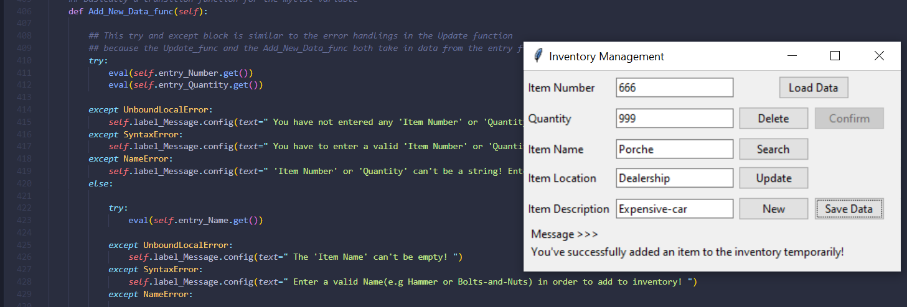
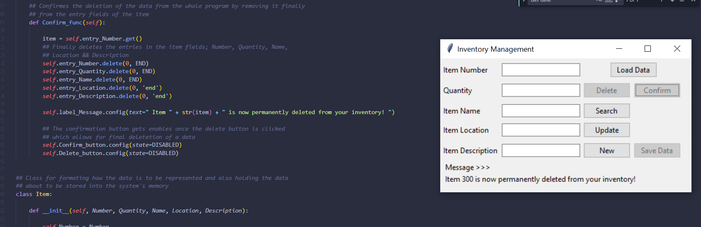

# Inventory Manager 
### Initial Screen


## Description 
An application use to store inventory data for just about any item. The database for 
this application is a simple text file where all the inventories are stored and comma separated (similar to a csv file).
Using the Tkinter library, the image below it the initial view creeated when the applicatio is executed 

Two separate applications are developed for this iventory management system, one which is the ***Inventory_System.py*** and the other a ***Item.py*** program

### How to get started:
  * Inventory_System.py - This is the main application where all the ***CRUD*** functionalities are implemented 
  * Item.py - This is a class used within Inventory_System.py for creating objects for every items stored in the inventory

  #### How to run the application
  **( Execution through the ***Terminal*** e.g. cmd, powershell, or bash)**
  ```powershell 
  python Inventory_System.py
  ```


### Features (***CRUD***)
- [x] *Create* - Add a new entry into the Inventory database 




- [x] *Read* - Load the database into the application and search for any given item based on it ***Item Number***


- [x] *Update* - Search for any given item and update its record in the inventory 
<!--  -->

- [x] *Delete* - Delete any given record from the inventory, and update the database 


